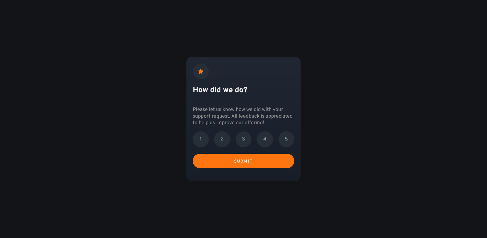
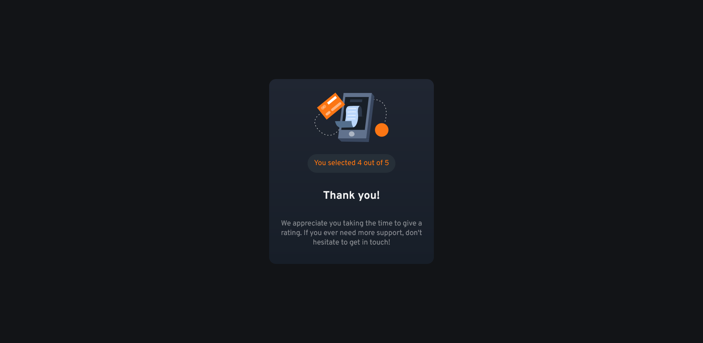

# Frontend Mentor - Interactive rating component solution

This is a solution to the [Interactive rating component challenge on Frontend Mentor](https://www.frontendmentor.io/challenges/interactive-rating-component-koxpeBUmI). Frontend Mentor challenges help you improve your coding skills by building realistic projects.

## Table of contents

- [Overview](#overview)
  - [The challenge](#the-challenge)
  - [Screenshot](#screenshot)
  - [Links](#links)
- [My process](#my-process)
  - [Built with](#built-with)
  - [What I learned](#what-i-learned)
  - [Continued development](#continued-development)
  - [Useful resources](#useful-resources)
- [Author](#author)

**Note: Delete this note and update the table of contents based on what sections you keep.**

## Overview

### The challenge

Users should be able to:

- View the optimal layout for the app depending on their device's screen size
- See hover states for all interactive elements on the page
- Select and submit a number rating
- See the "Thank you" card state after submitting a rating

### Screenshot




### Links

- Solution URL: [Frontend Mentor Solution](https://www.frontendmentor.io/solutions/interactive-rating-component-using-html-css-js-and-sass-QWE0eH84qL)
- Live Site URL: [Interactive Rating Component](https://drangam9.github.io/interactive-rating-component/)

## My process

### Built with

- Semantic HTML5 markup
- CSS custom properties
- Javascript
- Flexbox
- Mobile-first workflow
- Sass

### What I learned

This project taught me how to manipulate the DOM with Javascript. It's also the first project where I use Sass, and I have to admit, it really is Syntactically Awesome.

I also learned a little thing in CSS called ```not```. This helped me make the selected rating lose the hover effect (selecting the rating changed its bg color to orange, but the hover effect kept changing it to gray whenever the cursor was on it).
This was fixed by using ```not```, which makes the hover property availabale only on elements that DON'T have the ```.clicked``` class in them.

```css
.rate-score:not(.clicked):hover {
  background-color: hsl(217, 12%, 63%);
  cursor: pointer;
}
.rate-score:not(.clicked):hover p {
  opacity: 1;
}
```

### Continued development

The main area that I should be focusing on more from now on is using Javascript to create functionality. I should also look further into more CSS properties like `not` that might save me from trying over-complicated things in js.

### Useful resources

- [Using `not` in CSS](https://stackoverflow.com/questions/30118246/disable-hover-on-click) - This Stack Overflow question helped me solve the issue mentioned above.

## Author

- Website - [drangam9](https://github.com/drangam9)
- Frontend Mentor - [@drangam9](https://www.frontendmentor.io/profile/drangam9)
